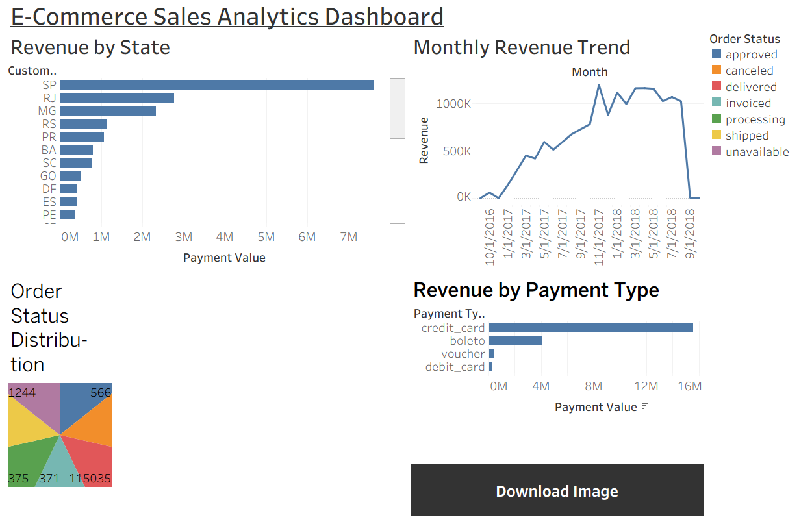

# E-Commerce Sales Analytics Dashboard

## Project Overview
This project analyzes e-commerce sales data using Python and Tableau.

## Tools Used
- Python
- Pandas
- Tableau Public

## Analysis Performed
- Revenue by State
- Monthly Revenue Trend
- Order Status Distribution
- Revenue by Payment Type

## Dashboard Preview

## Key Insights
- SP generated the highest revenue.
- Credit Card was the most preferred payment method.
- Revenue showed strong growth during 2017–2018.
- Most orders were successfully delivered.

## Files
- analysis.py
- state_revenue.csv
- monthly_revenue.csv
- order_status.csv
- payment_type.csv
